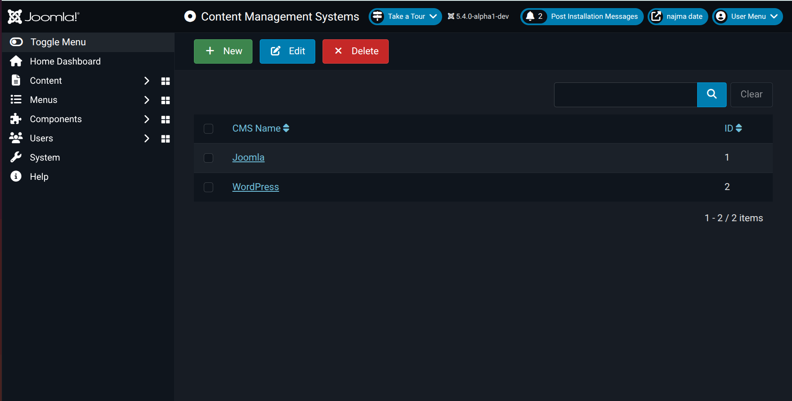
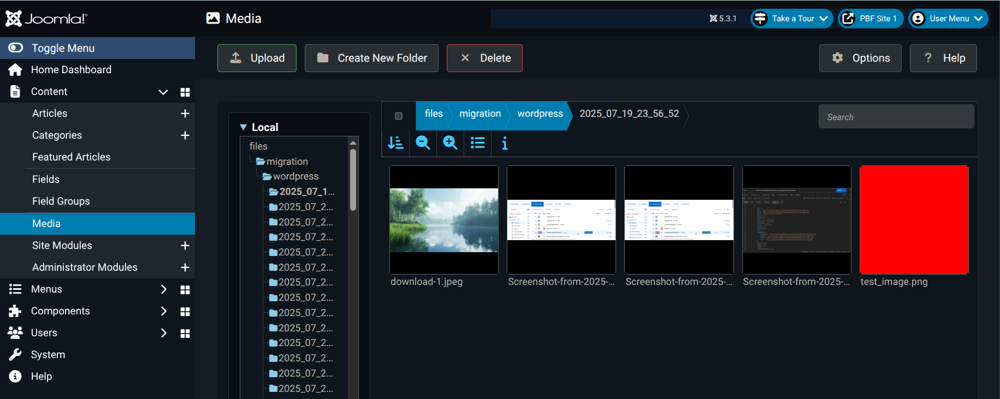

# User Guide - Content Migration Between CMSs Using CCM & MDE

## 📋 Overview

The Content Creation Management (CCM) component is a Joomla extension that enables seamless content migration between different Content Management Systems (CMS) using a Common Content Model (CCM) and Model-Driven Engineering (MDE) format. This project facilitates migration between WordPress, Joomla and easily extending other CMS platforms.

## 🚀 Features

- **Multi-CMS Support**: Migrate content between WordPress, Joomla, and more.
- **Standardized Format**: Uses CCM schema for consistent content representation.
- **Metadata Preservation**: Maintains content metadata during migration.
- **User-Friendly Interface**: Intuitive Joomla administrator interface.
- **Simple Migration Feedback**: Displays a success message upon completion or a detailed failure message if migration fails.

## 🛠️ Prerequisites

- **Joomla 4.0+** instance
- **PHP 8.1+** with MySQLi extension
- **MySQL/MariaDB** database

## 📦 Installation

### Joomla Installation

1. Open your Joomla app *(Preferably a new instance)*
2. Access the administrator panel
3. Navigate to **System > Install > Extensions**
4. Upload the zip file for the component

### Database Setup

The component will automatically create the required database tables upon installation:
- `#__ccm_cms` - Stores CMS configurations
- Initializes the CMSs available for migration

## 📝 How to Use the CCM Component

### 1. Editing a CMS

1. In Joomla Admin, go to **Components > CMSs > CMS Management**
2. Choose one of the CMSs
3. Update the CMS details:
   - **Name**: Descriptive name for the CMS
   - **URL**: Base URL of the source CMS
   - **Credentials**: API keys or authentication details. Follow the next steps to get the credentials. Refer to [Auth Guidance](AUTHENTICATION_GUIDE.md) for developer details.

### 2. Obtaining CMS Credentials & Adding them in Joomla CMS

Before you can migrate content, you need to obtain the proper API credentials for each CMS:

#### For WordPress

**Generate Application Password**:
   - Go to **My Sites → Settings → Security**
   - Scroll down to **Application Passwords**
   - Click **Create New Application Password**
   - Enter name: "CMS Migration" *or any preferred name*
   - Copy the generated password
   - In CMS Management, choose "WordPress"
   
   - We need the username and the password.
   - Add them in the WordPress credentials like the following:
   

#### For Joomla
1. **Create API Token**:
   - Go to **System > Manage > API Tokens**
   - Click **New** to create a new token
   - Enter a **Title** for the token
   - Select appropriate **User** (should have necessary permissions)
   - Click **Save**
   - Copy the generated token
   - In CMS Management, choose "Joomla"
   - Add the generated token.
   

> **Security Note**: Always use dedicated API credentials with minimal required permissions. Never use your main administrator password for API access.

### 3. Running a Migration

1. Navigate to **Components > CMSs > Migration**
2. Select source and target CMS
3. Click **Apply Migration**
4. At the end, monitor the success migration and the failed ones (if any).

### 4. Migration Process

The migration follows these steps:

1. **Content Extraction**: Retrieves content from source CMS via API
2. **CCM Conversion**: Transforms content to CCM standard format
3. **Target Conversion**: Adapts CCM format to target CMS structure
4. **Import**: Creates content in target CMS

### 5. Limitations & Adjustments for the cusrrent WordPress > Joomla
   - WordPress can have multiple categories, while Joomla uses a single category per article. So the migration process migrates only the first category attached with the post in WordPress.
   - WordPress has comments while Joomla doesn't, so they aren't migrated.
   - WordPress has Posts and Articles, both are migrated to Articles in Joomla.
   - Duplicate entries can cause failure to all migrations. Prefer to apply the migration in a new Joomla website.
   
   - Media are migrated in "files" folder. The migration process creates "migration" folder and another folder is createds inside it with the name of the source CMS. Each time the migration is applied, a folder with the date now is created with all the media files.
   

### 6. What is migrated now

- **Content Types**: Categories, Tags, Media, Users, Articles, Menus, and Menu-Items
- **Relationships**: Category and Tags associations, Media in the Articles text and User assignments
